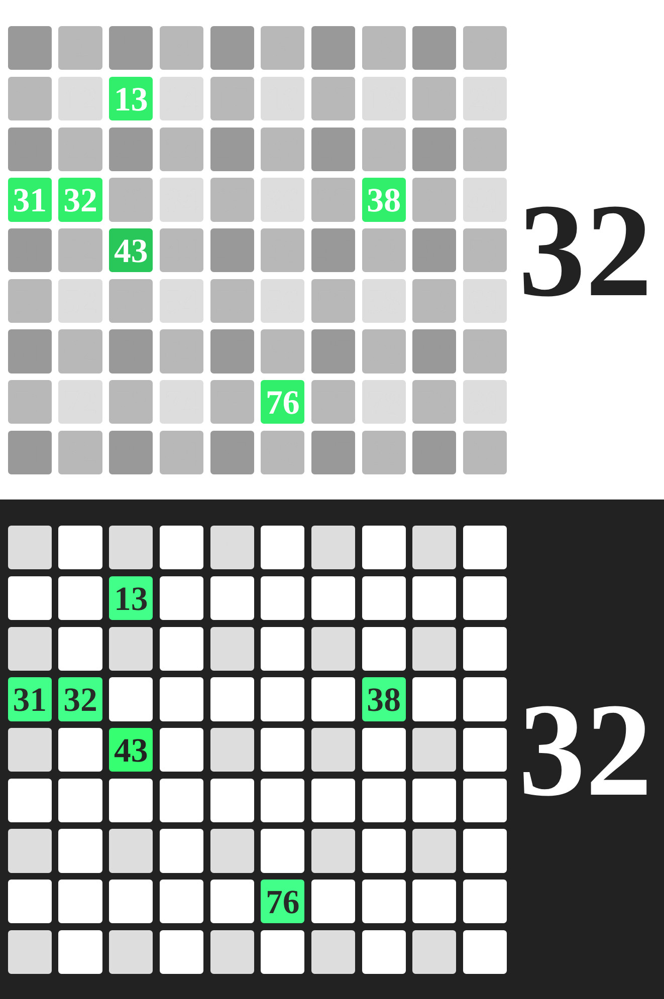

# Loto associatif

## Mode d'emploi

Pour l'utiliser il suffit d'ouvrir la page [loto](https://peppsac.github.io/loto-associatif/loto.html).

Ensuite :
- un clic sur un numéro sorti pour le colorer
- recharger la page pour recommencer une partie
- appui sur la touche f pour passer en plein écran (Esc pour quitter)
- un clic sur le dernier numéro sorti pour l'annuler

## Le résultat

----

Note: si vous souhaitez changer les couleurs vous pouvez télécharger le fichier raw de `loto.html` depuis la page [loto](loto.html) puis faire les modifications.
